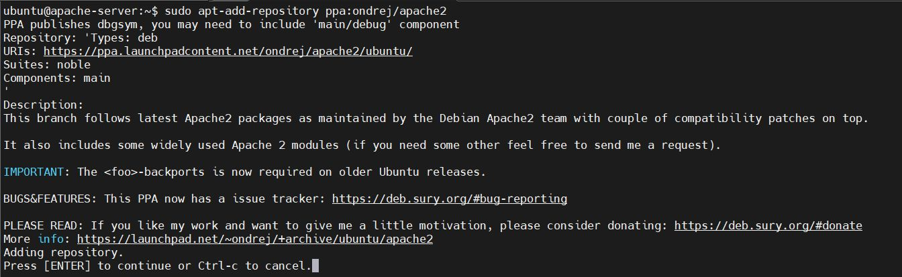

Generic Setup & Prerequisites
=============================

Update and upgrade the system,

.. code-block:: bash

    sudo apt update && sudo apt full-upgrade -y

We are going to install the latest version of apache2 server. In order to do that, 
we have to add the stable repository of the latest version in our machine.

.. code-block:: bash

    sudo apt-add-repository ppa:ondrej/apache2

Press Enter to Continue.

.. raw:: html

   

Next again update the system, to pull the latest packages accordingly. Then install the apache2 server.

.. code-block:: bash
    
    sudo apt update
    sudo apt install apache2

After the installation, although the server starts its service automatically, it better to be sure as aways.
Check the server status and make sure it is active.

.. image:: ../../assets/images/apache2-server-hardening/apache2-server-hardening-img-2.png
    :alt: Checking Apache2 Server Status
    :align: center

.. raw:: html

   

