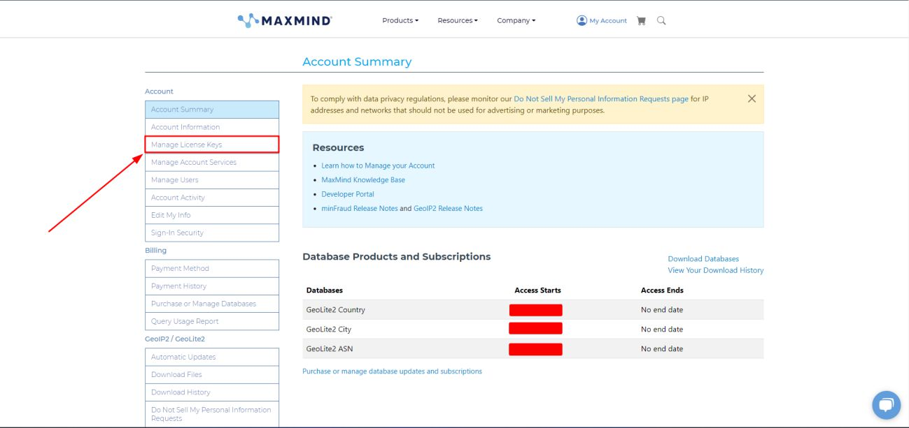
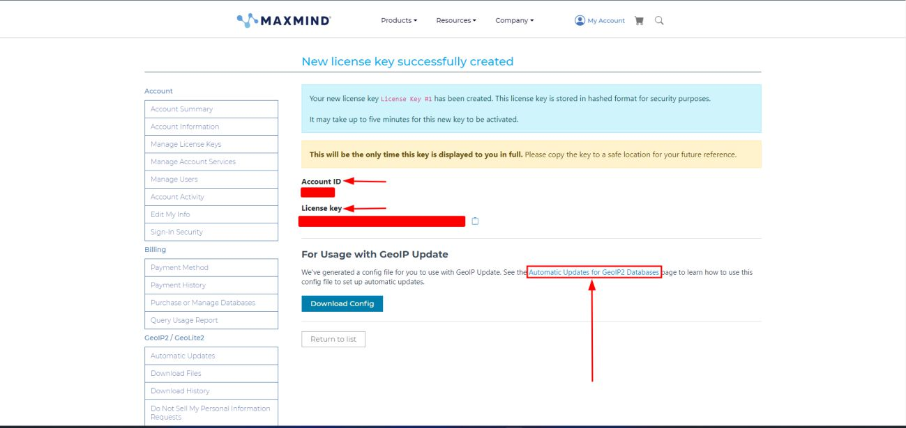

Setting Up Mod Maxmind DB
=========================

**mod_maxminddb** is an Apache module that allows the server to query MaxMind DB files to identify information about a website visitor based on their IP address. 
It is the modern successor to the now-deprecated `mod_geoip <https://github.com/maxmind/geoip-api-mod_geoip2>`_. It basically allows Apache to determine a client’s geographic and network-related information—such as country, 
city, ASN, or organization—based on the client IP address.

Now let’s work on installing the ``mod_maxminddb`` using the latest MaxMind Database. The ``mod_maxminddb`` is also known as ``mod_geoip v2``.

Prerequisites - (`Reference <https://github.com/maxmind/mod_maxminddb#requirements>`_)
------------------------------------------------------------------------------------------------

This module requires Apache 2.2 or 2.4 to be installed, including any corresponding "dev" package, such as ``apache2-dev`` on Ubuntu. 
You should have ``apxs`` or ``apxs2`` in your ``$PATH``.

You also must install the `libmaxminddb <https://github.com/maxmind/libmaxminddb>`_ C library.

Installing libmaxminddb
~~~~~~~~~~~~~~~~~~~~~~~

Download and extract their latest official release from `libmaxminddb GitHub <https://github.com/maxmind/libmaxminddb>`_ Page.

.. code-block:: bash

    wget https://github.com/maxmind/libmaxminddb/releases/download/<version>/libmaxminddb-<version>.tar.gz
    tar -xzvf libmaxminddb-<version>.tar.gz
    cd libmaxminddb-<version>

Replace the ``<version>`` with latest version following their GitHub `libmaxminddb Release <https://github.com/maxmind/libmaxminddb/releases>`_ page.

Next, to install it, run the following commands,

.. code-block:: bash

    ./configure
    make
    make check
    make install
    ldconfig

After installing, the **libmaxminddb** library will be available at ``/usr/local/lib``

If everything goes well, you will receive this output in the prompt. Refer to the image below for a high level view,

.. image:: ../../assets/images/projects/apache2-server-hardening/settingup-modmaxminddb-1.png
    :alt: libmaxminddb Installation Message - Successful
    :align: center

.. raw:: html

   

.. note::

    You can skip the ``make check`` step but it's always good to know that tests are passing on your platform.

    The configure script takes the standard options to set where files are installed such as ``--prefix``, etc. See ``./configure --help`` for details.

    If after installing, you receive an error that **libmaxminddb.so.0** is missing you may need to add the lib directory in your prefix to your library path. 
    On most Linux distributions when using the default prefix (``/usr/local``), you can do this by running the following commands,

    .. code-block:: bash

        sudo sh -c "echo /usr/local/lib  >> /etc/ld.so.conf.d/local.conf"
        ldconfig

    Otherwise, you can skip this step.

Installing mod_maxminddb
------------------------

Install the required apache2 dev package,

.. code-block:: bash

    apt install apache2-dev

Next, download and extract the mod_maxminddb latest official release from their `mod_maxminddb GitHub <https://github.com/maxmind/mod_maxminddb>`_ page.

.. code-block:: bash

    wget https://github.com/maxmind/mod_maxminddb/releases/download/<version>/mod_maxminddb-<version>.tar.gz
    tar -xzvf mod_maxminddb-<version>.tar.gz
    cd mod_maxminddb-<version>

Replace the ``<version>`` with latest version following their GitHub `mod_maxminddb Release <https://github.com/maxmind/mod_maxminddb/releases>`_ page.

To install the module, run the following commands,

.. code-block:: bash

    ./configure
    make install

If everything goes well, you will this dialogue ``preparing module `maxminddb' in /etc/apache2/mods-available/maxminddb.load`` in the prompt

Refer to the image below for a high level view,

.. image:: ../../assets/images/projects/apache2-server-hardening/settingup-modmaxminddb-2.png
    :alt: mod_maxminddb Installation Message - Successful
    :align: center

.. raw:: html

   

So far the installation of **mod_maxminddb** is complete.

Installing the Maxmind Database
-------------------------------

Now let’s pay attention to this step carefully. Coming this far you might get a little bit confused whether we installed the module or the database. 
We actually installed the module only; the database doesn’t come with the installation procedure.

So, to install the Maxmind Database from MaxMind we need to create an account in their portal. 
GeoIP basically has two versions of databases, one is free and the other is paid. 
Well, the paid one comes with comes with some distinct features of course, but the free version gets most of the jobs done any ways. 
I would say both of them are highly reliable.

Here, we are going to go with the free version.

Go and `Sign Up <https://www.maxmind.com/en/geolite2/signup>`_ for an account to get access to the GeoLite Database from the link.
Once you are done creating the account, head over to Manage License Keys and generate a key and keep it safe and saved for future use, 
as we are going to need it for the database installation.

.. raw:: html

   

After generating the key, it will also show your user along. Remember to keep is safe and secured as well, case it will also be need for the database installation.

.. raw:: html

   

You can also checkout the procedure of how you can keep your databases up to date as geoip2 receive weekly updates. 
I am not demonstrating that here as, it is already well documented in their website and you can easily access the page via clicking that link from your account.

Now head over to the **Download Files**

.. image:: ../../assets/images/projects/apache2-server-hardening/settingup-modmaxminddb-5.png
    :alt: Path to Download Files
    :align: center

.. raw:: html

   

And then get the Permalinks of GeoLite Database.

.. image:: ../../assets/images/projects/apache2-server-hardening/settingup-modmaxminddb-6.png
    :alt: Path to Download Files
    :align: center

.. raw:: html

   

Finally run this command in your Machine to download the GeoLite2 Database using your user id and key that we have obtained earlier.

.. code-block:: bash

    wget --content-disposition --user=YOUR_ACCOUNT_ID --password=YOUR_LICENSE_KEY '<permalink_URL>'

Replace ``--user``, ``--password`` & ``<permalink_URL>`` with your actual credentials. Once the downloading has finished **Extract** ``.tar.gz`` file.

.. tip::

    For more detailed information regarding downloading and automatically updating the databases, 
    refer to their official documention about `Using GeoIP Update <https://dev.maxmind.com/geoip/updating-databases/#using-geoip-update>`_.

So far installation of the database is complete.

Configuring the mod_maxminddb Module
------------------------------------

Now, we need to configure the mod_maxminddb module. Head over to the ``/etc/apache2/mods-available`` directory and create a file named ``maxminddb.conf``,
which will be the actual configuration file of the **MaxMindDB** module.

Apply the directives in the configuration file as given below,

.. code-block:: apache

    MaxMindDBEnable On
    MaxMindDBFile COUNTRY_DB </path/to/maxmind/database/.mmdb/file>
    MaxMindDBEnv COUNTRY_CODE COUNTRY_DB/country/iso_code
    MaxMindDBNetworkEnv COUNTRY_DB COUNTRY_NETWORK
    MaxMindDBSetNotes On

    <Directory /var/www>
        SetEnvIf COUNTRY_CODE ^(US|SG|NL|RU|DE|FR|BD) BlockCountry
        <RequireAll>
            Require env COUNTRY_CODE
            Require not env BlockCountry
        </RequireAll>
    </Directory>

Replace ``</path/to/maxmind/database/.mmdb/file>`` with the actual path to the country database file. You can also specify the countries to be blocked as you like in
the ``^()`` block as you like.

.. note::

    In this case scenario, only the database related to country aka ``COUNTRY_DB`` was used, 
    where countries with their Alpha-2 Code are used to block the specified country. This is more like a black-listing approach.
    Database related to cities can also be used, refer to their `MaxMindDBFile Directive <https://github.com/maxmind/mod_maxminddb?tab=readme-ov-file#maxminddbfile>`_
    and keeping following along to know how to use the ``CITY_DB``.

.. tip::

    Cases may vary depending on situations and scenarios, for which it is highly recommended to explore various use cases that would serve the cause.
    Follow along the `Usage Section <https://github.com/maxmind/mod_maxminddb?tab=readme-ov-file#usage>`_ to have a clear understanding of
    its directives and use cases.

Enabling mod_maxminddb Module
~~~~~~~~~~~~~~~~~~~~~~~~~~~~~

First check if the maxminddb module is enabled,

.. code-block:: bash

    apache2ctl -M | grep maxminddb_module

If it's enabled, it will show an output like **maxminddb_module (shared)**.

Otherwise, if you don't find anything similar, run the command below to enable it,

.. code-block:: bash

    a2enmod maxminddb

Then finally restart the apache2 server to put it into action.

.. code-block:: bash

    systemctl restart apache2

You shouldn't receive any error is everything is alright.

Testing the mod_maxminddb Module
--------------------------------

In order to test the module, we will be requiring a **VPN** from the countries specified to be blocked. Set up a VPN connection and trying access the http server via
your browser using the apache2 server URL

It should return a ``403 Forbidden`` status in response, blocking your access.

Refer to the image below for a high level view,

.. image:: ../../assets/images/projects/apache2-server-hardening/status-403-forbidden.png
    :alt: Returing 403 Forbidden status
    :align: center

.. raw:: html

   

Finally, from here, this concludes the setting up of Mod Maxmind DB

