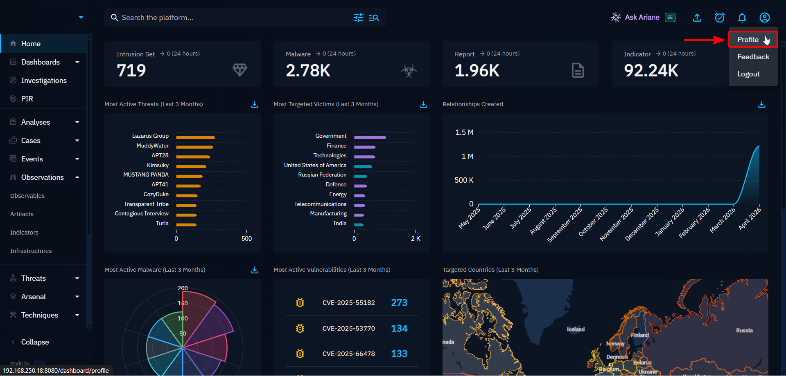
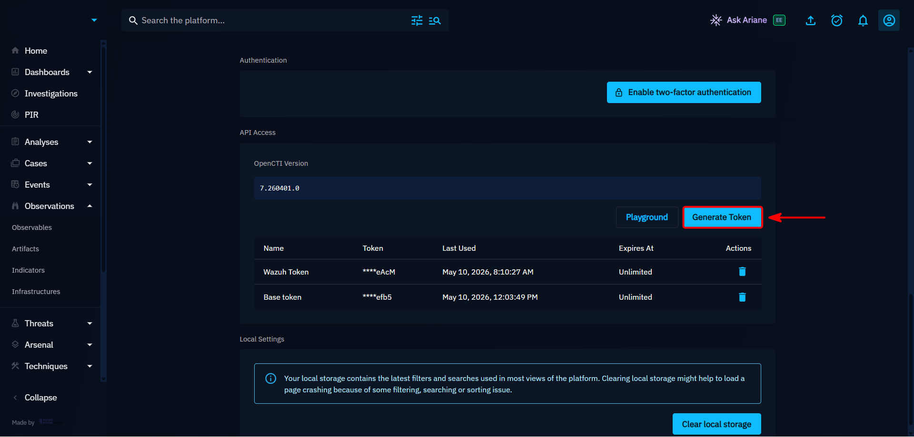
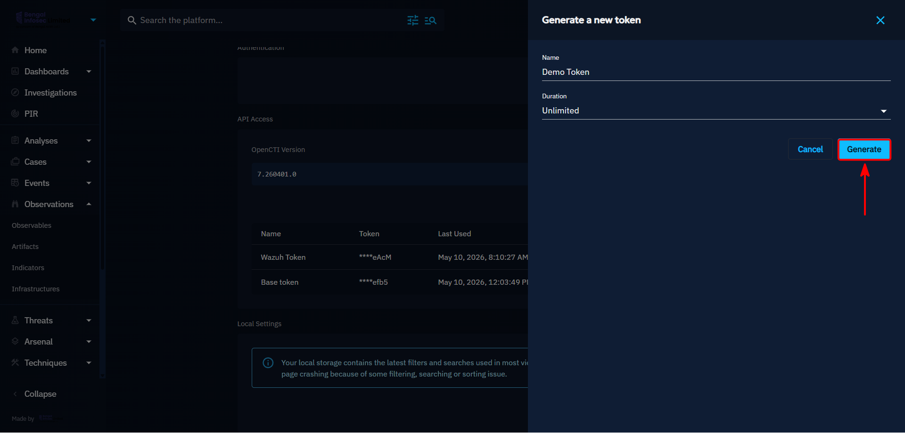

Prerequisites & Essentials
==========================

In this section, we will cover the necessary configurations required on both the OpenCTI platform and Wazuh Manager
to ensure the successful integration of the Wazuh-OpenCTI integration. This includes setting up API access, configuring
the integration script, and ensuring that the necessary permissions for seamless communication.

Obtaining OpenCTI API Access
----------------------------

To obtain API access to our OpenCTI platform, we will need to create an API key. This can be done by following these steps,

1. Log in to your OpenCTI platform with an account that has administrative privileges.
2. Navigate to the profile section of the OpenCTI dashboard
3. Under API Access section, click Generate Token
4. Provide a relevant name for the API key (e.g., "Wazuh Token") and set duration as needed.
5. Click Generate to create the API key.

Refer to the image slider below for a visual guide on how to generate an API key in OpenCTI,

.. raw:: html

   

.. raw:: html

   

.. raw:: html

   

Copy the generated API key and store it securely, as it will be required for configuring

Deployment of the Integration Scripts
-------------------------------------

After obtaining the API key from OpenCTI, the next step is to deploy the integration script on the Wazuh Manager. 
This script will be responsible for fetching data from Wazuh and sending it to OpenCTI.

Downloading the Integration Scripts
~~~~~~~~~~~~~~~~~~~~~~~~~~~~~~~~~~~

There are two scripts that need to be deployed:

- :download:`custom-opencti.py <../../assets/scripts/wazuh-opencti-integration/custom-opencti.py>`: This is the main integration script that will handle the communication between Wazuh and OpenCTI.
- :download:`custom-opencti <../../assets/scripts/wazuh-opencti-integration/custom-opencti>`: This is the wrapper script for wazuh to execute the main integration script.

Download both scripts using ``wget`` or ``curl`` and place them in the appropriate directory on your Wazuh Manager. 
The scripts must be placed in the ``/var/ossec/integrations/`` directory to ensure that Wazuh can execute them properly.

Setting Up Appropriate Permissions
~~~~~~~~~~~~~~~~~~~~~~~~~~~~~~~~~~

After placing the scripts in the ``/var/ossec/integrations/`` directory, it is crucial to set the appropriate permissions to ensure that Wazuh can execute them without any issues.
Run the following command to set the correct permissions for both scripts:

.. code-block:: bash

    sudo chown root:wazuh /var/ossec/integrations/custom-opencti.py
    sudo chown root:wazuh /var/ossec/integrations/custom-opencti
    sudo chmod 750 /var/ossec/integrations/custom-opencti.py
    sudo chmod 750 /var/ossec/integrations/custom-opencti

This command changes the ownership of the scripts to the root user and the wazuh group, and sets the permissions to allow execution by the owner and group while restricting access for others.

Script Configuration Guidelines
-------------------------------

Before executing the integration script, it is essential to know and get familiar with the configuration parameters that need to be set in the script.
Although the script is designed to be just plug and play, it is important to understand the parameters that can be configured to tailor the integration to your specific needs, if think these 
parameters are more relatable to your environment. These parameters include:

1. **LOG_MISSES**: Writes a log line even when OpenCTI has no record of the IOC, and when we pre-filter an IOC (e.g. private IP). 
Useful for gap analysis ("how often does Wazuh see IOCs that OpenCTI doesn't know?"). Disable if disk space is tight or the log gets too noisy.

2. **INCLUDE_RAW_RESPONSE**: Embeds the full raw GraphQL response in each log line under "raw_response". 
This to obtain every detail OpenCTI returns. The Logs will be very heavy. Useful for case investigation and referencing. 
Disable to shrink log lines significantly if you only need the flat summary fields.

.. warning::

    The default values for both of these parameters are set to ``False`` to prevent excessive logging and disk usage.
    If disk space is not a concern, and you want to have detailed logs for analysis, you can set these parameters to ``True``. 
    However, be cautious as this may lead to large log files over time.

    In fact, the script has been tested with these parameters set to ``True``. Wazuh Manager is not able to handle the load of the logs when these parameters are set to ``True``, 
    since the filebeat module of Wazuh Manager is not configured to handle such a large amount of logs. The script will work, and it will also log these events, 
    but it will not be indexed in the Wazuh's Opensearch Indexer. 

    However, there is a solution to to that problem, but that will involve configuring the filebeat and opensearch indexer modules of Wazuh Manager to 
    handle the large amount of logs generated by the integration script when these parameters are set to ``True``. Refer to the solution page to this problem,
    but, if you are okay with the defaults, then you can just skip this part and move on to the next section.

3. **IOC_TYPES_TO_EXTRACT**: This is a dictionary that defines the types of IOCs to extract from Wazuh alerts and query OpenCTI for enrichment.

4. **ALLOWED_DOMAINS**: This is a list of allowed domains for domain IOCs. Basically whitelisting your preferred domains or internal domain that will not be checked at OpenCTI.

5. **ALLOWED_IPS**: This is a list of allowed IPs for IP IOCs. Basically whitelisting your preferred IPs or internal IPs that will not be checked at OpenCTI.

.. note::

    There are more parameters that can be configured in the script, but these are the most important ones that you should be aware of before executing the script.
    You can go through the whole configurable parameters in the script to get a better understanding of what can be configured and how it can be configured, in the
    ``CONFIG`` section of the script. The script is designed to be flexible and customizable to fit your specific needs, so feel free to explore the configuration #
    options and adjust them as needed for your environment.

.. attention::

    Since the script is designed to generate logs under ``/var/osses/logs/opencti.log``, Wazuh's Automated Log Rotation feature is not applied for this log file.
    Therefore, it is highly recommended to use **logrotate** or similar log management tools to manage this log file and prevent it from consuming too much disk space over time. 
    You can configure **logrotate** to rotate the log file daily, weekly, or monthly, and to keep a certain number of rotated logs before deleting them.