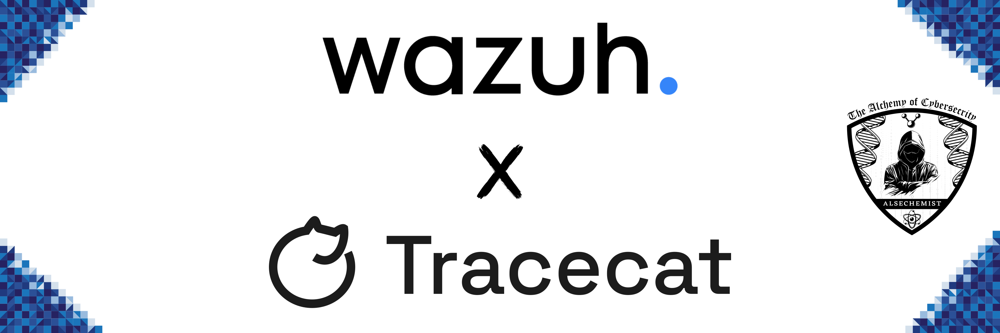

Introduction - Wazuh & Tracecat Integration
=============================================

**Wazuh** is the vigilant sentinel that never sleeps—a comprehensive security monitoring platform deployed as distributed agents across your infrastructure, 
detecting threats in real-time through log analysis, file integrity monitoring, and behavioral analysis. 
Its Active Response capability transforms it from a passive watcher into an active defender, automatically executing countermeasures when threats emerge.

**Tracecat** is the intelligent conductor orchestrating your security symphony—a modern SOAR platform with limitless possibilities. Beyond automated response, 
Tracecat orchestrates comprehensive incident management: investigating alerts in real-time, enriching threats with intelligence, 
mapping attack patterns, managing cases end-to-end, and enhancing threat monitoring with continuous intelligence integration. 
It seamlessly connects with any API-enabled security tool, standardizing security operations and transforming your 
team's focus from reactive firefighting to strategic threat defense.

Together, Wazuh detects. Tracecat orchestrates the entire response symphony—investigating, correlating, enriching, managing, and 
neutralizing threats at machine speed while your security team focuses on strategic decisions.

.. raw:: html

   

.. attention::
   
   This Project assumes that you have already setup **Wazuh** and **Tracecat** in respective environment. Besides, if you don't want to go through too many details,
   you can just have your ``Quick Start`` by referring to the :doc:`configuration-of-servers` section of the documentation.

.. toctree::
   :maxdepth: 3
   :hidden:

   ../../projects/wazuh-tracecat-integration/the-power-of-integration
   ../../projects/wazuh-tracecat-integration/what-we-will-learn
   ../../projects/wazuh-tracecat-integration/scope-of-engagement
   ../../projects/wazuh-tracecat-integration/configuration-of-servers
   ../../projects/wazuh-tracecat-integration/use-cases
   ../../projects/wazuh-tracecat-integration/conclusion
