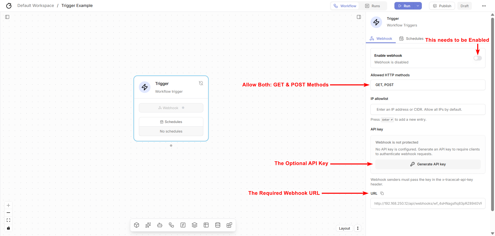

Overview: Tracecat Server
=========================

Alright, lets have a brief overview of the Tracecat Server. In this section, we will only be looking at **Trigger** coponent of the Tracecat Server.

This this main and by default placed component of very workflow of the Tracecat Server, which is responsible for receiving the alerts from the Wazuh Server and then triggering the execution of the workflow.

.. raw:: html

   

