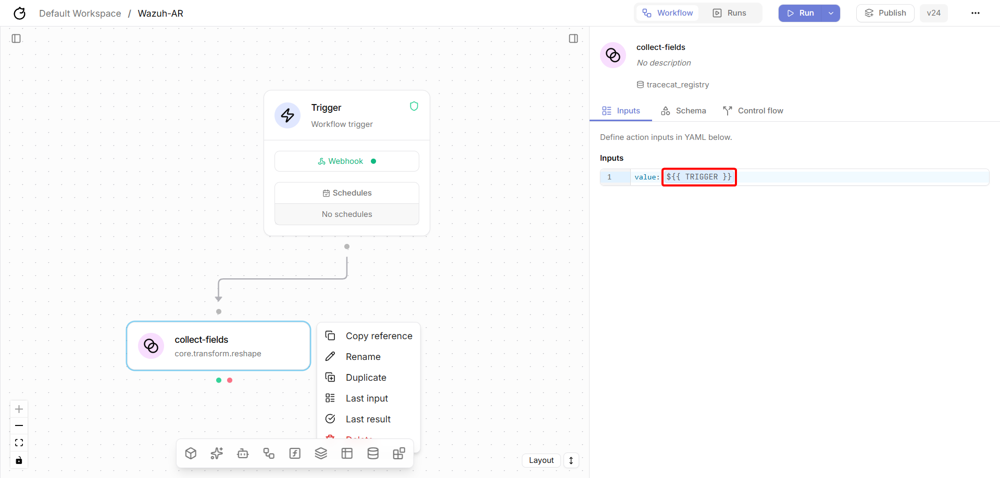
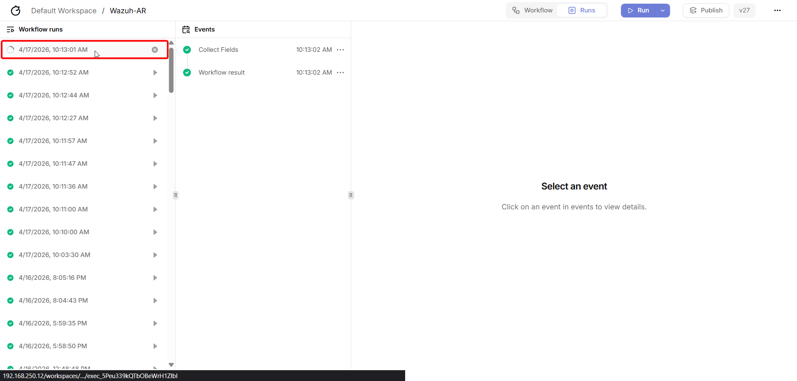
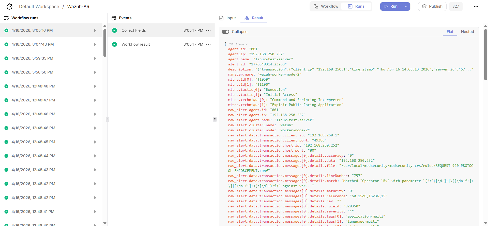
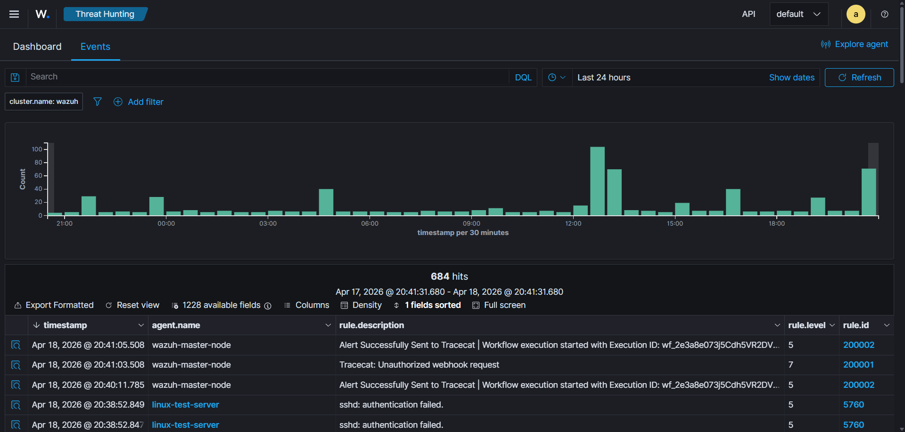
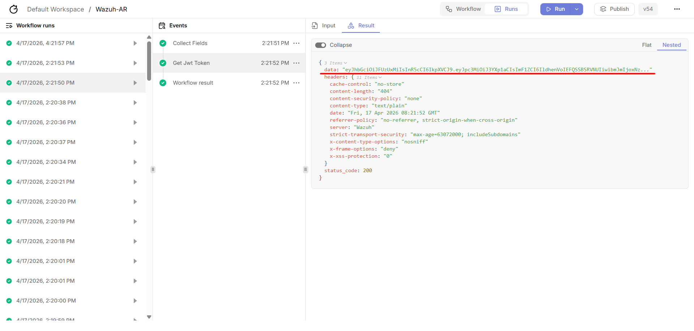
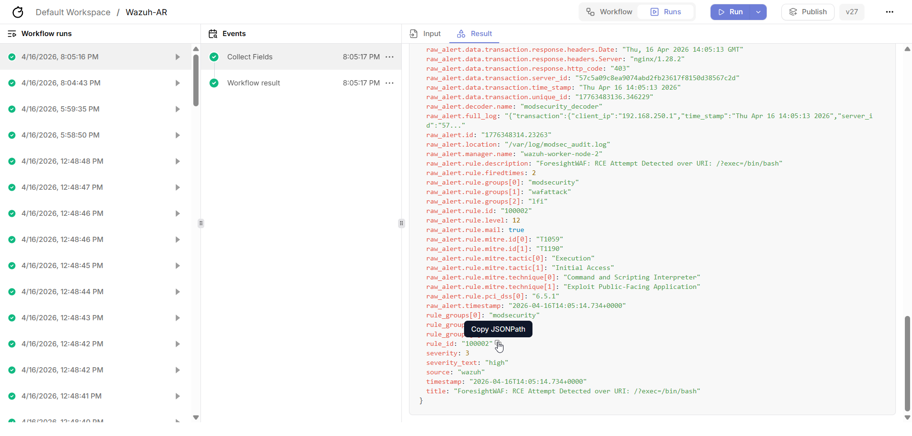

Tracecat Server Components
==========================

In this section, we will explore the bare minimum components that we need to have on our Tracecat Server in order 
to be able to receive the alerts from Wazuh and trigger the corresponding playbooks.

Component - core.transform.reshape
----------------------------------

This is the component that is reponsible for showing the incoming json field from the Wazuh alerts in a more readable format. 
It is a built-in component that is available in Tracecat by default, so you don't need to create it from scratch. 
You can simply add it to your workflow and configure it to reshape the incoming json data as needed.

Basically, if the script is working right, then all the field from the json alert will directly be handled by the Trigger componnent. 
But you won't be able to see it and also the the relevant json path required to be used as expressions. 
So, you can use the Reshape component to have a more readable format of the incoming json data and also to be able 
to easily identify the relevant fields and their corresponding json paths that you can use in your workflow components.

Follow the image below for a high level view of how the Reshape component is configured in the workflow,

.. raw:: html
    
    

All you need to do is, in the **Inputs** section, set the value to ``${{ TRIGGER }}``. 
This will allow the Reshape component to recive the json field from the wazuh alerts.

Testing the Integration
-----------------------

To test the integration, copy and paste this dummy alert and save it as test-alert.json into the Wazuh manager to 
see if it triggers the Tracecat workflow as expected, you can use the following command to create the test alert:

.. code-block:: bash

    cat > /opt/test-alert.json << 'EOF'
    {
        "id": "1234567890",
        "timestamp": "2026-04-14T10:00:00.000+0000",
        "rule": {
            "id": "5503",
            "level": 7,
            "description": "User login failed",
            "groups": ["authentication_failed", "pam"],
            "mitre": {
            "id": ["T1110"],
            "tactic": ["Credential Access"],
            "technique": ["Brute Force"]
            }
        },
        "agent": {
            "id": "001",
            "name": "web-server-01",
            "ip": "192.168.1.50"
        },
        "manager": {
            "name": "wazuh-manager"
        },
        "full_log": "Failed password for invalid user admin from 192.168.1.100 port 22 ssh2"
    }
    EOF

This command creates a test alert in the Wazuh manager with the specified details.

Now, you can use the following command to run the script manually with the test alert to see if it triggers the Tracecat workflow as expected:

.. code-block:: bash
    
    bash /var/ossec/integrations/custom-tracecat \
        /opt/test.json \
        "[tracecat-workflow-api-key]" \
        "[tracecat-webhook-url]" \
        debug

Make sure to replace ``[tracecat-workflow-api-key]`` with the actual API key of your Tracecat workflow if it requires one, 
and replace ``[tracecat-webhook-url]`` with the actual webhook URL of your Tracecat workflow.

.. note::
    
    If your Tracecat workflow does not require an API key for authentication, you can simply omit the API key parameter when running the script:

    .. code-block:: bash
        
        bash /var/ossec/integrations/custom-tracecat \
            /opt/test.json \
            "" \
            "[tracecat-webhook-url]" \
            debug

This will allow you to test the integration and ensure that the Wazuh server is able to successfully send alerts to 
Tracecat and trigger the corresponding workflows based on the test alert you created.

If everything is set up correctly, you should see following script output indicating that the alert was sent to Tracecat successfully,

.. code-block:: bash
    
    # Tracecat responded [200]: {"message":"Workflow execution started","wf_id":"[WF_ID]","wf_exec_id":"[WF_EXEC_ID]"}

You can also check the Tracecat Workflow run section, where the workflow executions are listed and 
see if the workflow was triggered and executed successfully based on the test alert you created.
Refer to the image below to see where the workflow execution will appear in Tracecat,

.. raw:: html
    
    

This where the workflow execution will automatically appear once the alert is sent from Wazuh to Tracecat, 
and you can click on it to see the details of the execution and the steps that were executed in the workflow.
You will be able to see all the field in the results tab. 

As for an real alert you will see something with more details and fields based on the actual alert that is sent from Wazuh to Tracecat,

.. raw:: html
    
    

This way, you can easily identify the relevant fields and their corresponding json paths that are required to be used in your workflow components.

Checking the Integration Logs
-----------------------------

The script is also designed to log its activities, which can be helpful for troubleshooting and ensuring that the integration is working as expected.
You can check the logs for the integration script in the ``/var/ossec/logs/`` directory, specifically in the ``tracecat.log`` file.

You can use the following command to view the logs:

.. code-block:: bash
    
    tail -f /var/ossec/logs/tracecat.log

This command will display the latest entries in the ``tracecat.log`` file in real-time, allowing you to monitor the integration's activities and identify any potential issues.

Besides, with the custom rules that we configuired earlier, you should also be able to see Wazuh Event Logs like the image below,

.. raw:: html
    
    

With the Wazuh server configured to execute the integration script, 
you can now proceed to the prerequisite steps for setting up the Tracecat server and 
ensuring that it can receive the alerts from Wazuh and trigger the corresponding workflows.

Component - core.http_request
-----------------------------

This one the main components that we need in order to contact with any API of a third-party system, including Wazuh's API itself.
It is also a built-in component that is available in Tracecat by default, so you don't need to create it from scratch.
You can simply add it to your workflow and configure it to send the necessary API requests to Wazuh's API or any other third-party system as needed.

In almost every case of Wazuh related workflows, we will be needing to retrivge the Wazuh JWT token in order to be able to send authenticated API requests to Wazuh's API.
So, now we will be seeing how can we configure the Http Request component to send a POST request to Wazuh's API to retrive the JWT token.

Copy the configuration below and place it in the **YAML** tab of the **Inputs** section of the Http Request component,

.. code-block:: yaml

    url: https://[wazuh-server-ip-address]:55000/security/user/authenticate?raw=true
    method: POST
    auth:
        password: ${{ SECRETS.wazuh_wui.WAZUH_WUI_PASSWORD }}
        username: ${{ SECRETS.wazuh_wui.WAZUH_WUI_USERNAME }}
    verify_ssl: false

Make sure to replace ``[wazuh-server-ip-address]`` with the actual IP address of your Wazuh server.

The YAML tab allows you to place your configurations more freely than the Form tab. You will also see in the form tab that the fields are 
automatically filled based on the YAML configuration, but you can always edit the YAML configuration as needed.

Follow the image below for a high level view of how the Http Request component is configured in the workflow,

.. image:: ../../assets/images/projects/wazuh-tracecat-integration/tracecat-server-workflow-contifiguration-5.png
    :alt: Tracecat Server, Configuration of Http Request Component in the Workflow
    :align: center

.. raw:: html
    
    

This way, you can easily configure the Http Request component to send the necessary API requests to Wazuh's API or any other third-party system as needed.

You will be able to see the JWT token in the results tab of the Http Request component once the workflow is executed, 
and you can use it in the other components that require it by using the expression ``${{ ACTIONS.[component_name].result.data }}`` to access it.

Refer to the image below to see how the JWT token can be accessed in the other components using expressions,

.. raw:: html
    
    

All you have to do is to copy the json path of the JWT token from the results tab of the Http Request component and 
place it in the expression syntax to be able to access it in the other components that require it.

.. attention::

    Make sure to save and **Publish** the workflow everytime you make changes and this even applies for setting up everything for the first time. 
    For external webhook connectivity, workflows are required to be published, since everything is automated here, rather manually running the workflows.
    So workflows state will only get updated, if it is published, otherwise webook connectivity will follow the previous version of workflows.

    You will find the **Publish** button right next the Run button. 

Expressions
-----------

Expressions are a powerful feature in Tracecat that allow you to dynamically access and manipulate data within your workflow components.

So, How can we use the expressions to access the fields from the incoming json data from Wazuh alerts?

You can use the following syntax to access the fields from the incoming json data: ``${{ [expression.field_name] }}``

Replace ``[expression.field_name]`` with the json path of the field that you want to access. 
For example, if you want to access the ``rule.id`` field from the incoming json data, you can just copy and 
replace it in the expression syntax like this: ``${{ rule.id }}``

Follow the image below for a high level view of how to use expressions to access the fields from the incoming json data from Wazuh alerts,

.. raw:: html
    
    

.. tip::
    
    Make sure to use the correct json path for the field that you want to access. 
    Best, if you just copy and paste it into the expression syntax to avoid any typos or mistakes.
    Follow Tracecat's `Expression Guideline and Concept <https://docs.tracecat.com/automations/core-concepts/expressions>`_ for more details about expressions and how to use them effectively in your workflows.

So far, this basically concludes the Integration of Wazuh with Tracecat, and the configuration of the main components that 
are required on the Tracecat server in order to be able to receive the alerts from Wazuh and trigger the corresponding playbooks.

Now we can always look for some uses cases and scenarios to further extend the explorations and possibilities of the integration, 
and to see how we can leverage the integration to automate various security operations and incident response workflows.