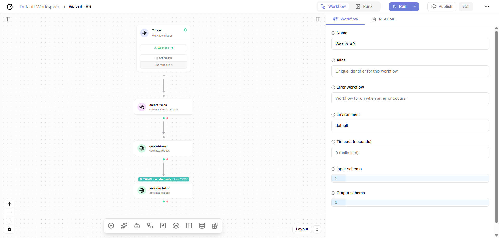
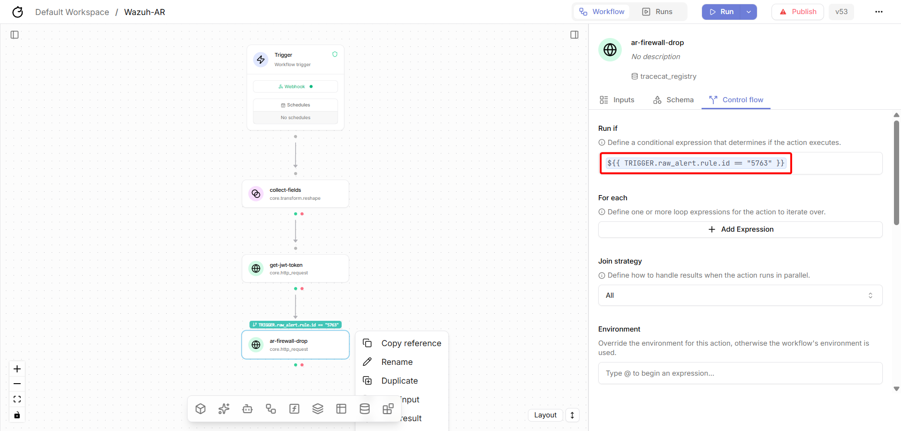
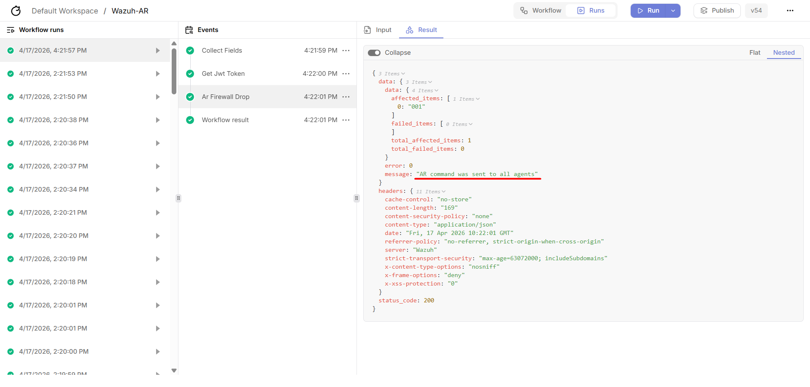
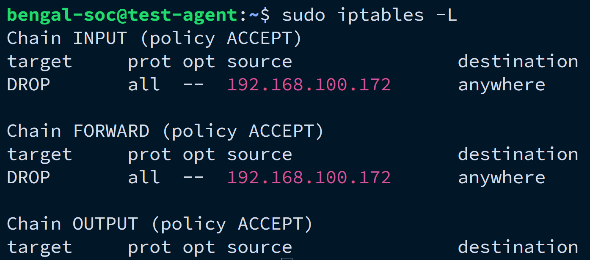
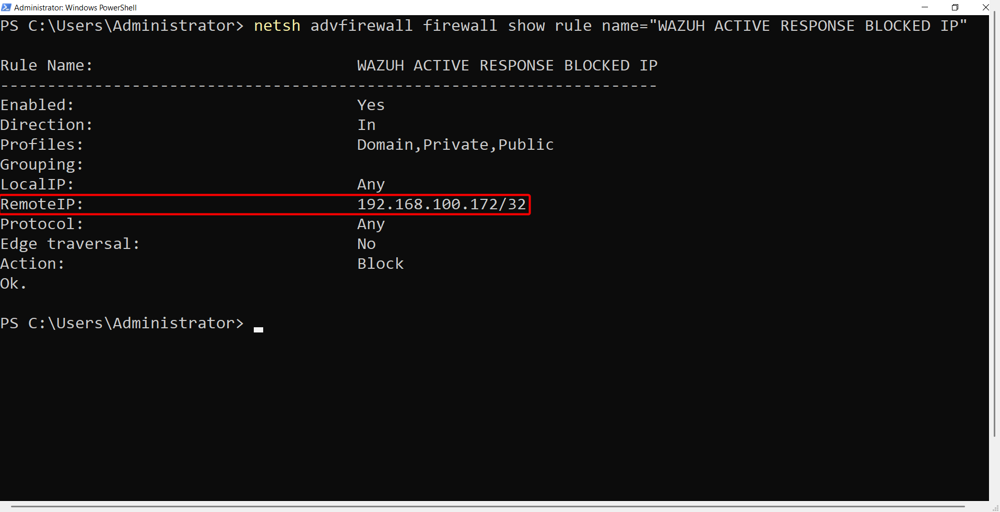
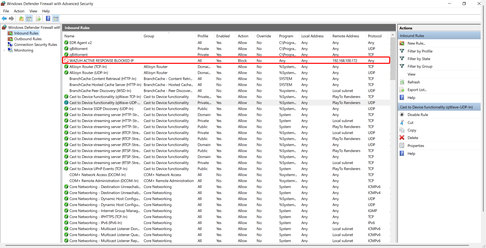
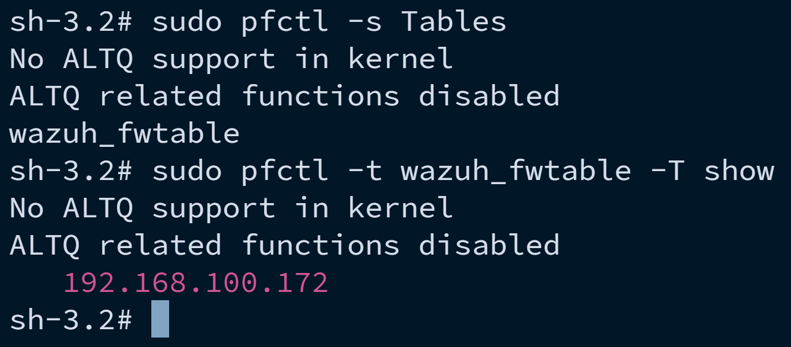

Leverageing Wazuh's Active Response with Tracecat Server to Automate Incident Response Playbooks
================================================================================================

In this use case, we will explore how to leverage Wazuh's Active Response 
capabilities in conjunction with Tracecat Server to automate incident response playbooks.

Workflow Overview:
------------------

Refer to the image below for a high-level overview of the workflow that we will be implementing in this use case.

.. raw:: html
    
    

In this workflow, we will be using Wazuh's Active Response to trigger a playbook in Tracecat Server whenever a specific alert is generated.

Prerequisites
-------------

Refer to the :doc:`Tracecat Server Components <tracecat-server-components>` page to know, how to setup up and configure the ``collect-field`` and ``get-jwt-token``
components in Tracecat Server, which are essential for this use case.

Component - ar-firewall-drop
----------------------------

It is the same core.http_request component of the Tracecat Server, but with a different configuration to perform the firewall drop action.

Copy and past the following configuration into the YAML tab of the component,

.. code-block:: yaml

    url: https://[wazuh-server-ip]:55000/active-response
    method: PUT
    verify_ssl: false
    headers:
        Authorization: Bearer ${{ ACTIONS.get_jwt_token.result.data }}
        Content-Type: application/json
    payload:
        arguments:
            - add
        command: "!firewall-drop"
    alert:
        data:
            srcip: ${{ TRIGGER.raw_alert.data.srcip }}
    params:
        agents_list:
            - ${{ TRIGGER.raw_alert.agent.id }}

Make sure to replace ``[wazuh-server-ip]`` with the actual IP address of your Wazuh server.

.. attention:: 

    The ``expressions`` used in the above configuration are based on the naming conventions of the coponenents. 
    If you have used different names for the components, make sure to update the expressions accordingly.

.. tip::

    After copying the ``JSON path`` of each expression field, make sure to add ``TRIGGER.`` 
    before the expression to ensure that it correctly references the alert data.

    For example, after copying the JSON path for the source IP address, it might look like this: ``"raw_alert.data.srcip"``. 
    You need to update it to ``TRIGGER.raw_alert.data.srcip`` for it to work correctly in the context of the Tracecat Server workflow.
    Make sure to remove the ``""`` quotes around the expression after adding the ``TRIGGER.`` prefix.

Conditional Workflow Execution
------------------------------

To ensure that the firewall drop action is only executed for specific a specific ``rule.id``, 
we will need to add a condition in the **Control Flow** tab of the component.

Copy and paste the following expression into the condition field,

.. code-block:: yaml

    ${{ TRIGGER.raw_alert.rule.id == "5763" }}

This condition checks if the ``rule.id`` of the triggered alert is equal to ``5763``, which corresponds to the rule for **SSH Brute Force Attack**.

Refer to the image below for a visual representation of how to add the condition in the Control Flow tab,

.. raw:: html
    
    

Testing the Workflow
--------------------

Generate a SSH Brute Force Attack to trigger the alert with ``rule.id`` 5763. You can use a tool like **Hydra** to perform the attack. 
Make sure to target an endpoint that is being monitored by Wazuh and has the appropriate agent installed.

Once the alert is generated, it will trigger the workflow in Tracecat Server. The workflow will check the condition for the ``rule.id`` and if it matches, 
it will execute the firewall drop action using Wazuh's Active Response.

Proof of Concept
----------------

Refer to the image below for a visual representation of the workflow execution in Tracecat Server after triggering the SSH Brute Force Attack,

.. raw:: html
    
    

In the image above, you can see that the workflow was triggered and executed successfully. The firewall drop action was performed as part of the workflow execution, 
with a message saying ``AR command was sent to all agents``, which indicates that the integration between Wazuh's Active Response and 
Tracecat Server is working as expected.

.. tip::

    You can also implement the same component for windows and macOS agents by simply changing the command in the 
    payload to the appropriate Active Response command for each operating system.

    Windows agents use the ``netsh`` command, where as macOS agents use the ``pf`` command for firewall rules management.
    You will also need to adjust the rule.id accordinly based on the rules that are relevant for each operating system, which
    is also necessary for their conditional workflow execution respectively as well.

Validation
----------

In this section we will see and validate if a malicious attacker or IP is actually blocked.

Linux Agents
~~~~~~~~~~~~

To check **Wazuh Active Response -** ``firewall-drop`` script has actually blocked a malicious IP. We need to check ``iptables`` rules list,
as the script leverages ``iptables`` to do its job. Copy and past the command below in your Linux Agent and make sure you have ``sudo`` privileges.

.. code-block:: bash

    sudo iptables -L

You should see ``iptables`` blocked the malicious IP.

.. raw:: html

   

Windows Agents
~~~~~~~~~~~~~~

To check **Wazuh Active Response -** ``netsh`` script has actually blocked a malicious IP. We need to check ``netsh`` rules list, or
we can check **Windows Defender Firewall** rules through the ``Advanced Settings``. Copy and past the command below in your Windows Agent via ``Command Prompt`` or ``Powrshell`` and
make sure you have ``administrative`` privileges.

.. code-block:: bash

    netsh advfirewall firewall show rule name=all | findstr /i "wazuh"
    netsh advfirewall firewall show rule name="WAZUH ACTIVE RESPONSE BLOCKED IP"

You should be able to see an output like this image below:

.. raw:: html

   

Or, you can also check it via the GUI Interface by simply going to **Windows Defender Firewall → Advanced Settings** and check the ``Inbound Rules`` 

.. raw:: html

   

As you can see, the exact same **Wazuh Rule** name is showing here as well.

macOS Agents
~~~~~~~~~~~~

To check **Wazuh Active Response -** ``pf`` script has actually blocked a malicious IP. We need to check ``pf`` rules list,
as the script leverages ``packet filter``, a firewall present by default in macOS devices to do its job.
Copy and past the command below in your Linux Agent and make sure you have ``sudo`` privileges.

.. code-block:: bash

    sudo pfctl -s Tables | grep -i wazuh
    sudo pfctl -t wazuh_fwtable -T show

You should see ``pf`` blocked the malicious IP.

.. raw:: html

   

