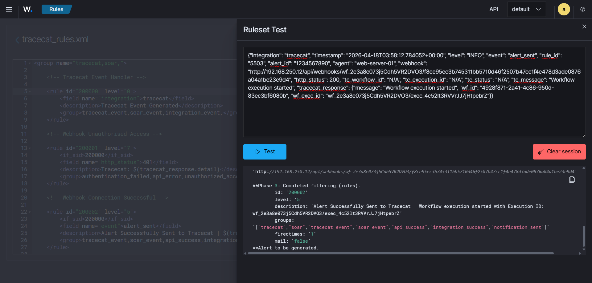

Wazuh Server
============

The Wazuh server is the core component of the Wazuh security monitoring system. 
It is responsible for collecting, analyzing, and correlating security events from various sources, 
including agents installed on endpoints, network devices, and cloud services. 
The Wazuh server processes the data received from these sources to identify potential security threats and generate alerts.

It is also responsible for managing various third-party integrations, including Tracecat itself.

Integration Scripts
-------------------

To integrate Tracecat with the Wazuh server, you need to download the integration script and also the wrapper script that Wazuh is programmed to execute. 

- :download:`custom-tracecat.py <../../assets/scripts/wazuh-tracecat-integration/custom-tracecat.py>` - This is the main script that is reponsible for sending Wazuh alerts to Tracecat and triggering the corresponding playbooks.
- :download:`custom-tracecat <../../assets/scripts/wazuh-tracecat-integration/custom-tracecat>` - This the wrapper script that Wazuh will execute. It is responsible for calling the main script and passing the necessary parameters to it.

.. note::
    
    Make sure to place these scripts in the ``/var/ossec/integrations`` directory on your Wazuh server. 
    And, if you are having mutiple Wazuh Manager Clusters, you will need to place these scripts in each of the Wazuh Manager Clusters.

Set Appropriate Permissions
~~~~~~~~~~~~~~~~~~~~~~~~~~~

After placing the scripts in the correct directory, you need to set the appropriate permissions to ensure that they can be executed by the Wazuh server.

You can use the following command to set the permissions:

.. code-block:: bash
    
    sudo chmod 750 /var/ossec/integrations/custom-tracecat
    sudo chmod 750 /var/ossec/integrations/custom-tracecat.py
    sudo chown root:wazuh /var/ossec/integrations/custom-tracecat
    sudo chown root:wazuh /var/ossec/integrations/custom-tracecat.py

This command sets the permissions to allow the owner (root) and the group (wazuh) to read, write, and execute the scripts, while others can only read and execute them.

Configuring Wazuh to Execute the Integration Script
---------------------------------------------------

After placing the scripts and setting the appropriate permissions, you need to configure Wazuh to execute the integration script when certain alerts are generated.
Go the Wazuh manager configuration file, which is typically located at ``/var/ossec/etc/ossec.conf``, and add the following configuration to the ``<integrations>`` section:

.. code-block:: xml
    
    <integration>
        <name>custom-tracecat</name>
        <hook_url>[tracecat-workflow-webhook-url]</hook_url>
        <api_key>[tracecat-workflow-api-key]</api_key> <!-- Optional: Only if your Tracecat workflow requires an API key for authentication -->
        <level>10</level>
        <alert_format>json</alert_format>
    </integration>

.. note::

    - The script is designed to handle mutiple workflow triggers, so you can add multiple ``<integration>`` blocks in the same way with different webhook URLs and API keys if needed.
    - You can also adjust the ``<level>`` tag to specify the minimum alert level that should trigger the integration script.
    - You can also use ``<rule_id>`` tag instead of ``<level>`` tag, if you want to trigger the integration based on specific rule IDs rather than alert levels. Multiple rule IDs are also supported as well by separating them with commas (e.g., ``<rule_id>1001,1002,1003</rule_id>``).

Make sure to replace ``[tracecat-workflow-webhook-url]`` with the actual webhook URL of your Tracecat workflow, 
and if your workflow requires an API key for authentication, replace ``[tracecat-workflow-api-key]`` with the actual API key.

The script is desined for both cases where the Tracecat workflow requires an API key for authentication and where it does not. Either way it will work just fine.

After adding this configuration, save the file and restart the Wazuh manager to apply the changes:

.. code-block:: bash
    
    sudo systemctl restart wazuh-manager

This will ensure that the Wazuh server is now configured to execute the ``custom-tracecat`` integration script whenever an alert with 
the specified level or higher is generated, allowing you to automate your incident response workflows using Tracecat.

Creating Custom Rules
---------------------

I personally thought that Wazuh should have a more specific rules for Tracecat related events, 
it believe it is essential to have it to be able to easily track and filter Tracecat related events in Wazuh,
specially when it can come handy in case where incident responders want to track the history of playbook executions and 
the triggered alerts that led to these playbook executions while reporting.

.. note::

    Wazuh already has its default JSON decoder that can decode any JSON log, including the logs generated by our integration script.
    Refer to Wazuh's `JSON Decoder <https://documentation.wazuh.com/current/user-manual/ruleset/decoders/json-decoder.html>`_
    documentation learn more about its default JSON decoder and how it works.

Create a custom rule file naming it ``tracecat_rules.xml`` in the wazuh dasboard and add the following content to it,

.. code-block:: xml
    
    <group name="tracecat,soar,">

        <!-- Tracecat Event Handler -->

        <rule id="200000" level="0">
            <field name="integration">tracecat</field>
            <description>Tracecat Event Generated</description>
            <group>tracecat_event,soar_event,integration_event,</group>
        </rule>

        <!-- Webhook Unauthorised Access -->

        <rule id="200001" level="7">
            <if_sid>200000</if_sid>
            <field name="http_status">401</field>
            <description>Tracecat: $(tracecat_response.detail)</description>
            <group>authentication_failed,api_error,unauthorized_access,attack,soar_alert,pci_dss_6.5,</group>
        </rule>
        
        <!-- Webhook Connection Successful -->
        
        <rule id="200002" level="5">
            <if_sid>200000</if_sid>
            <field name="event">alert_sent</field>
            <description>Alert Successfully Sent to Tracecat | $(tracecat_response.message) with Execution ID: $(tracecat_response.wf_exec_id)</description>
            <group>tracecat_event,soar_event,api_success,integration_success,notification_sent,</group>
        </rule>
        
    </group>

Hit save and reload to apply the changes.

In the above rules, we have created a base rule with ID 200000 that matches any event decoded by the default JSON decoder.
Then, we have created two child rules with IDs 200001 and 200002 that trigger based on specific conditions related to 
the HTTP status of the response from Tracecat and the event type.

There aren't many rules here, as the logging of Tracecat related event basically depends on the response we get from 
Tracecat and the responses are pretty straight forward, related to webhook connections mostly. 
But, these rules will be enough to achieve what we want, which is to be able to track the history of 
playbook executions and the triggered alerts that led to these playbook executions while reporting.

Testing the Decoder and Rules
-----------------------------

Copy and paste the following sample log in the Rules Testing Tool in the Wazuh Dashboard to see if the rules are working as expected,

.. code-block:: json

    {"integration": "tracecat", "timestamp": "2026-04-18T03:58:12.784052+00:00", "level": "INFO", "event": "alert_sent", "rule_id": "5503", "alert_id": "1234567890", "agent": "web-server-01", "webhook": "http://192.168.250.12/api/webhooks/wf_2e3a8e073j5Cdh5VR2DVO3/f8ce95ec3b745311bb5710d46f2507b47cc1f4e478d3ade0876a04a1be23e9d4", "http_status": 200, "tc_workflow_id": "N/A", "tc_execution_id": "N/A", "tc_status": "N/A", "tc_message": "Workflow execution started", "tracecat_response": {"message": "Workflow execution started", "wf_id": "4928f871-2a41-4c86-950d-83ec3bf6080b", "wf_exec_id": "wf_2e3a8e073j5Cdh5VR2DVO3/exec_4c52lt3RVVrJJ7jHtpebrZ"}}

You should see that the log is successfully decoded by our default JSON decoder by the name `json` and the appropriate rules are triggered based on the content of the log.

Follow the image below for a high level overview of the testing process,

.. raw:: html
    
    

This confirms that our custom rules are working as expected, and we should now be able to track Tracecat related events in Wazuh based on the defined rules.

Setting up Tracecat's Log Ingestion in Wazuh
--------------------------------------------

After creating and testing the custom rules, there is only one thing left to do, setting up the ``<localfile>`` directive in wazuh's configuration file
in order to tracecat's log to be automatically ingested into wazuh for monitoring and alerting purposes.

Add the following block in the Wazuh Manager Server configuration file, which is typically located at ``/var/ossec/etc/ossec.conf``, 
and search for the ``<localfiles>`` section,

.. code-block:: xml

    <localfile>
        <log_format>json</log_format>
        <location>/var/ossec/logs/tracecat.log</location>
    </localfile> 

Now, save the file and restart the Wazuh manager to apply the changes:

.. code-block:: bash
    
    sudo systemctl restart wazuh-manager

This configuration tells Wazuh to monitor the ``/var/ossec/logs/tracecat.log`` file for new entries, and to parse them as JSON logs.

.. important::

    Typcially, it is mostly seem that logs are pretty much collected from the wazuh agent monitored endpoints, but in this case we are collecting logs from 
    the Wazuh Manager, as the the traceat log are basically being generated from the integration script and the log will be created in the Wazuh Manager.
