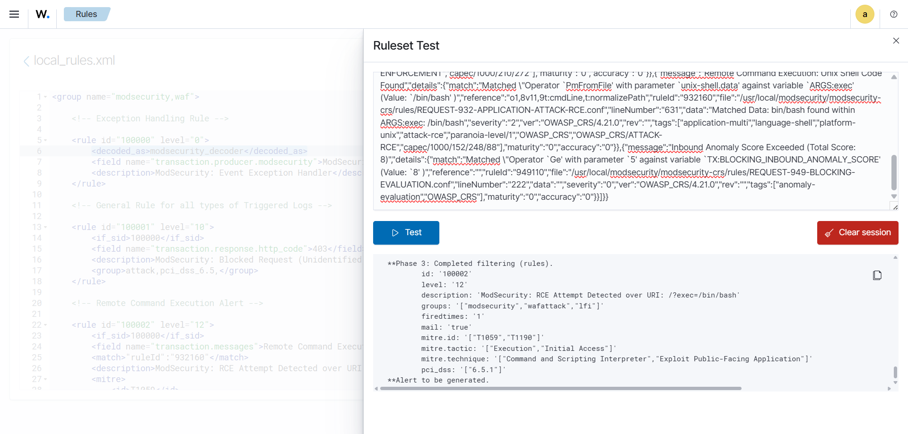

Rule Creation - Generating ModSecurity Alerts
=============================================

This section describes the creation of **custom Wazuh rules** that generate actionable alerts from JSON-formatted ModSecurity audit logs. 
These rules leverage the **decoder created previously** to detect web application attacks and suspicious requests, 
mapping them to relevant MITRE techniques and compliance categories.

Below is the **full ruleset** in a single code block:

.. code-block:: xml

    <group name="modsecurity,waf">

        <!-- Exception Handling Rule & General Rule for Catching All Rules-->

        <rule id="100000" level="3">
            <decoded_as>modsecurity_decoder</decoded_as>
            <field name="transaction.producer.modsecurity">ModSecurity</field>
            <description>ModSecurity Event: $(transaction.messages)</description>
        </rule>

        <!-- General Rule for all types of Triggered Logs -->

        <rule id="100001" level="10">
            <if_sid>100000</if_sid>
            <field name="transaction.response.http_code">403</field>
            <description>ModSecurity: Blocked Request (Unidentified) | Inspection Required</description>
            <group>attack,pci_dss_6.5,</group>
        </rule>

        <!-- Remote Command Execution Alert -->

        <rule id="100002" level="12">
            <if_sid>100000</if_sid>
            <field name="transaction.messages">Remote Command Execution</field>
            <match>"ruleId":"932160"</match>
            <description>ModSecurity: RCE Attempt Detected over URI: $(transaction.request.uri)</description>
            <mitre>
                <id>T1059</id>
                <id>T1190</id>
            </mitre>
            <group>attack,lfi,pci_dss_6.5.1,</group>
        </rule>

        <!-- Path Traversal Attack Alert -->

        <rule id="100003" level="12">
            <if_sid>100000</if_sid>
            <field name="transaction.messages">Path Traversal Attack</field>
            <match>"ruleId":"930110"</match>
            <description>ModSecurity: Path Traversal Attack Detected over URI: $(transaction.request.uri)</description>
            <mitre>
                <id>T1083</id>
            </mitre>
            <group>attack,lfi,pci_dss_6.5.1,mitre_t1083,</group>
        </rule>

        <!-- SQL Injection Attack Alert -->

        <rule id="100004" level="12">
            <if_sid>100000</if_sid>
            <field name="transaction.messages">SQL Injection Attack</field>
            <match>"ruleId":"942100"</match>
            <description>ModSecurity: SQL Injection Attack Detected over URI: $(transaction.request.uri)</description>
            <mitre>
                <id>T1190</id>
                <id>T1059</id>
            </mitre>
            <group>attack,sql_injection,pci_dss_6.5.1,gdpr_IV_35.7.d,</group>
        </rule>

        <!-- OS File Access Attempt Alert -->

        <rule id="100005" level="12">
            <if_sid>100002</if_sid> 
            <field name="transaction.messages">OS File Access Attempt</field>
            <match>"ruleId":"930120"</match>
            <description>ModSecurity: Mutiple Attach Patterns [RCE + OS File Access Attempt] over ($(transaction.request.uri))</description>
            <mitre>
            <id>T1083</id>
            <id>T1190</id>
            </mitre>
            <group>attack,lfi,pci_dss_6.5.1,mitre_t1083,</group>
        </rule>

    </group>

.. tip::

    To better understand the rules and its field attributes. It is highly recommended to check out Wazuh's 
    `Rule Writing Syntaxes <https://documentation.wazuh.com/current/user-manual/ruleset/ruleset-xml-syntax/rules.html>`_

Ruleset Testing
---------------

Once applied, the results should be the same as we have seen in the :doc:`Decoder Creation <../../research/modsecurity-log-detection-wazuh/decoder-creation>` part. Except this time, in **Phase - 3**, the created rules should be triggered.

Check the image below for reference,

.. raw:: html

       

In other words, it means that our custom created rules are working perfectly.

.. note::

    If you are not sure, how we have handled the exception, that we have seen in the :ref:`unexpected-rule-trigger` part, we have actually called ``<decoded_as>json</decoded_as>``
    to kind of override the ``rule id - 1002`` that was being triggered earlier. The explanation of the action is, that we specifically called the name of the decoder ``json``
    which was being triggered during **Phase - 2** of decoder testing and also uniquely identified by defining ``<field name="transaction.producer.modsecurity">ModSecurity</field>``
    which mean that the rule will be trigger spacially if it sees that, the logs are being generated from ``ModSecurity``
